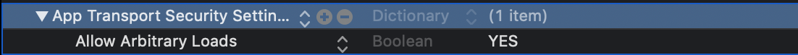
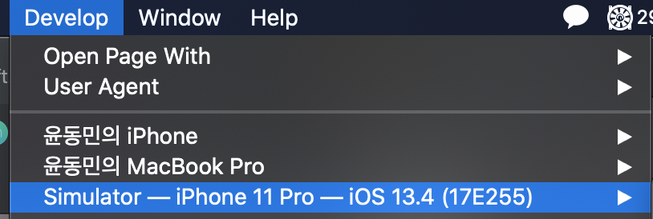
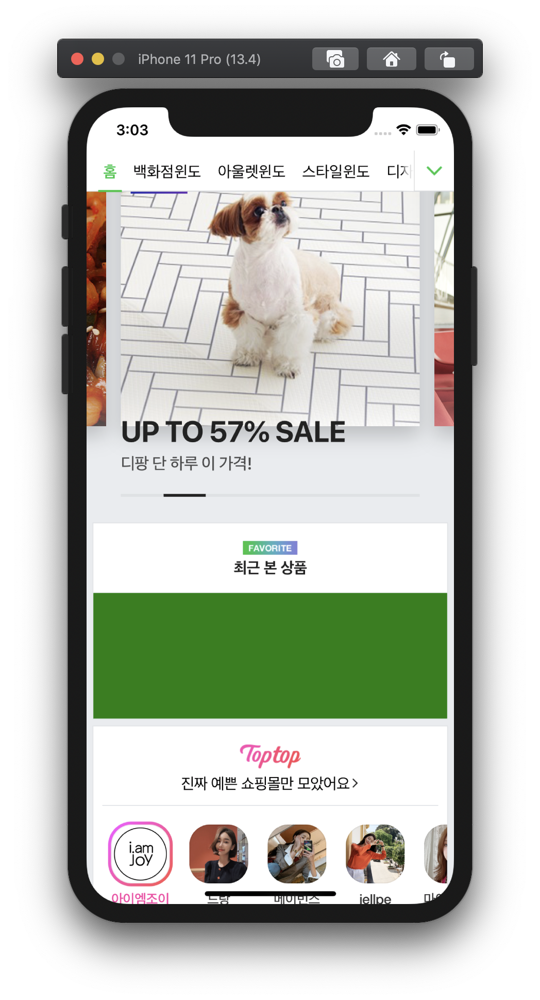

# swift-webviewapp

<br>

***WKWebView vs UIWebView 차이***

👉 우선 iOS 2.0부터 **`UIWebView`**가 도입되었고, **`WKWebView`**는 iOS 8.0에서 도입되었다.

👉 **`UIWebView`**는 **UIkit**의 일부이고 **`WKWebView`**는 **WebKit**이라는 프레임워크의 일부이다.

👉 **`WKWebView`**와 **`UIWebView`**의 큰 차이는 성능이다. **`WKWebView`**가 **`UIWebView`**보다 더 높고 효율적인 성능을 보여준다.

👉 **`WKWebView`**는 8500개의 개체를 렌더링하지만 **`UIWebView`**는 3500개의 개체를 렌더링하며 **`WKWebView`**의 성능은 **`UIWebView`**와 비교하여 두 배이다.

👉 **`WKWebView`**는 25%의 CPU을 사용하여 같은 수의 입자를 렌더링하지만, **`UIWebView`**는 동일한 작업에 대해 90%의 CPU을 사용한다.

👉 **`UIWebView`**는 한 번 로드되고, 데이터는 쿠키에 저장되므로 다음 번 로딩 시간은 이전에 비해 적다. 그러나 **`WKWebView`**는 쿠키가 저장되지 않으므로 항상 로딩 시간이 동일하다.

👉 **`WKWebView`**는 프로세스를 벗어나 실행된다. 즉, 메모리와 앱이 별도의 스레드에서 돌아간다. **`UIWebView`**는 앱과 같은 프로세스 내에서 실행된다.

👉 **`WKWebView`**는 JavaScript를 비동기적으로 처리 : 네이티브 코드 간의 통신의 **`WKWebView`**에서 비동기적으로 처리된다. 즉, 일반적으로 더 빠르게 실행됩니다.   

<br>


---

###Step 2

***WKWebView 이용***

 **WKWebView** 이용하여 하이브리드 앱을 만들어볼 것이다. 우선 HTTP 통신을 위해 `info.plist`에서 HTTP 통신을 허용해주어야 한다.




✅ **`WKUIDelegate`**

> WebView UserInterface에 관한 델리게이트 패턴으로 구성된 프로토콜이다. 유저의 인터페이스에 관한 작업들에 관한 내용들이 정의되어 있다. 

1️⃣ 사용을 위해 `WKUIDelegate` 프로토콜을 채택한다.

2️⃣ 채택한 프로토콜을 `WebView` 객체에 넣어준다.

```swift
class ViewController: UIViewController {
  @IBOutlet weak var webView: WKWebView!
  
  override func viewDidLoad() {
    // WebView 객체에 등록
    webView.uiDelegate = self
  }
}

// 프로토콜을 채택
extension ViewController: WKUIDelegate {
}
```

<br>

🔵 **WKUIDelegate 메소드**

👉 웹에서 호출되는 JavaScript Alert을 대신 처리해주는 메소드

```swift
// 메소드에서 JavaScript에서 들어오는 Alert 액션을 받아와서 여기에서 처리하면 된다.
// 여기 메소드에서는 확인에 관한 하나의 동작만 처리할 수 있다.
func webView(_ webView: WKWebView, runJavaScriptAlertPanelWithMessage message: String, initiatedByFrame frame: WKFrameInfo, completionHandler: @escaping () -> Void) {
  let alertController = UIAlertController(title: message, message: nil, preferredStyle: .alert)
  let cancelAction = UIAlertAction(title: "확인", style: .cancel) { _ in
     completionHandler()
  }
  alertController.addAction(cancelAction)
  DistpatchQueue.main.async {
    self.present(alertController, animated: true, completion: nil)
  }
}

// 역시 위의 메소드와 같은 기능을 하지만 차이점은 확인과 취소에 관한 두 가지의 처리가 가능하다.
// Completion 클로저에 (Bool) 타입을 통해 확인과 취소에 관한 컨트롤이 가능하다.
func webView(_ webView: WKWebView, runJavaScriptConfirmPanelWithMessage message: String, initiatedByFrame frame: WKFrameInfo, completionHandler: @escaping (Bool) -> Void) {
  let alertController = UIAlertController(title: message, message: nil, preferredStyle: .alert)
  let okAction = UIAlertAction(title: "확인", style: .default) { _ in
  	completionHandler(true)
  }
  let cancelAction = UIAlertAction(title: "취소", style: .cancel) { _ in
		completionHandler(false)
	}

  alertController.addAction(cancelAction)
  alertController.addAction(okAction)
  DispatchQueue.main.async {
    self.present(alertController, animated: true, completion: nil)
  }
}
```

<br>

 ***Mac에서 iOS Simulator와 Safari을 사용한 웹앱 디버깅하는 법***

1️⃣ 우선 디버깅을 위해 Safari ➡️ Preference ➡️ Advanced ➡️ 선택을 하게 되면 이제 개발자 메뉴를 볼 수 있다.

2️⃣ 업데이트가 되어서 기존에 사파리와 다르게 [Safari Technology Preview](https://developer.apple.com/safari/technology-preview/)을 다운해주어야한다.

3️⃣ 이후 Simulator로 웹 앱을 실행하고 사파리에서 밑의 그림과 같은 메뉴를 클릭해 디버깅을 한다.



4️⃣ 해당 옵션으로 실행 후, **Element** 탭에서 원하는 HTML 속성을 변경하여 확인한다.

<br>

***실행화면***



